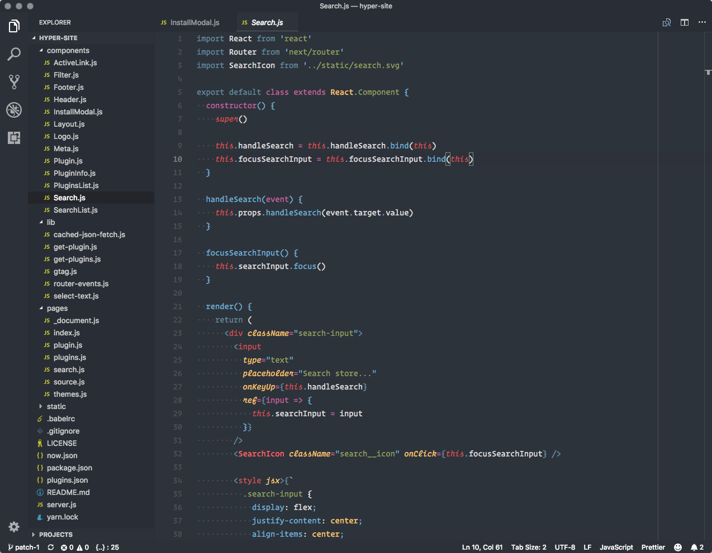
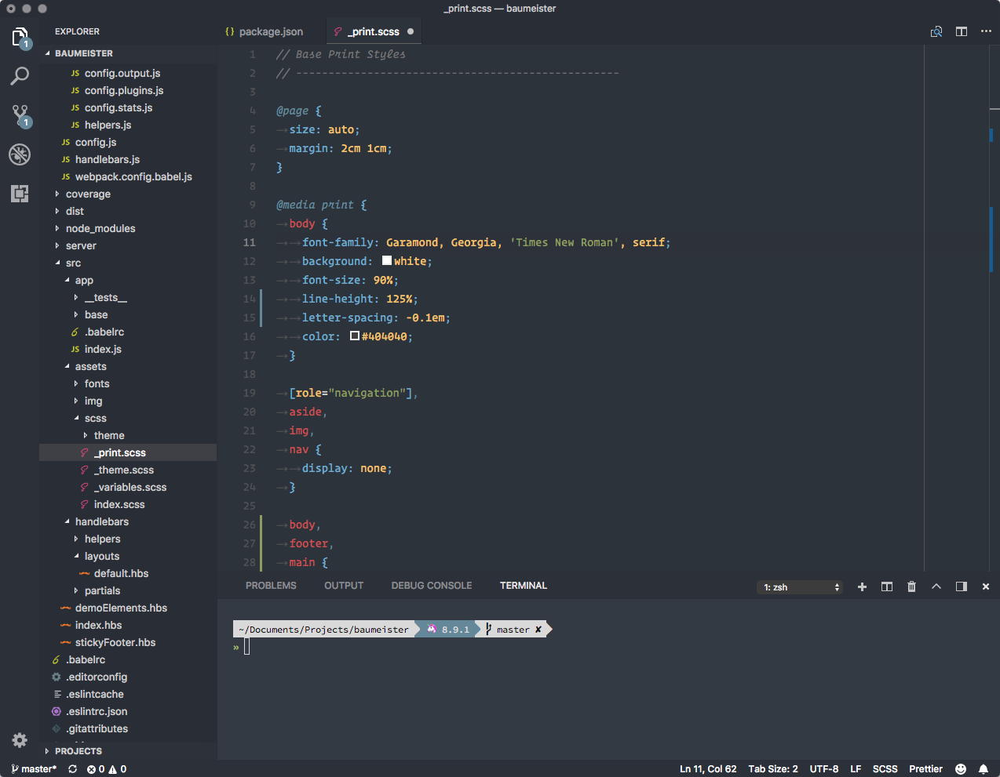
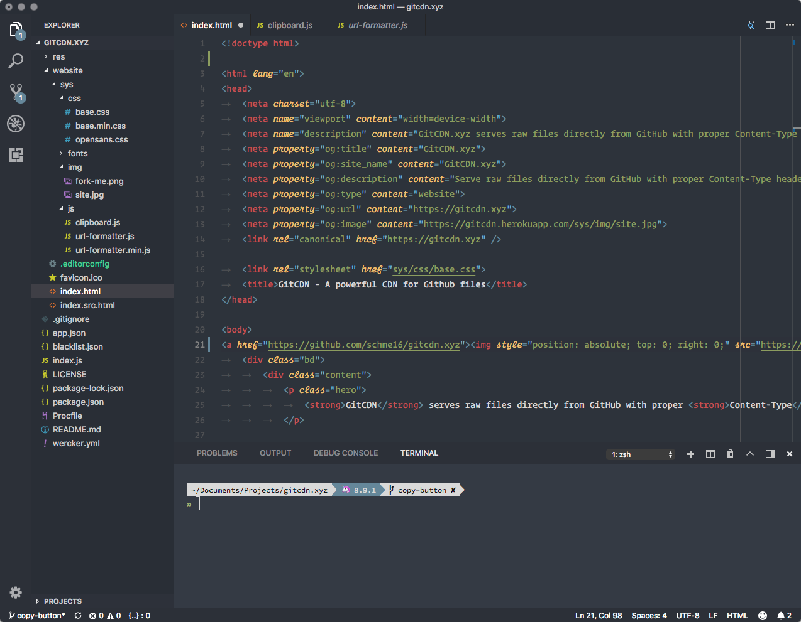

# Relaxed Theme for Visual Studio Code

> A relaxed VS Code theme to take a more relaxed view of things.

  
Screenshot: Sass

  
&nbsp;</p)>
  

  
Screenshot: HTML

  
&nbsp;</p)>
  

## Installation

1. Open **Extensions** sidebar panel in VS Code. `View → Extensions`
2. Search for `Relaxed`
3. Click **Install** to install it.
4. Click **Reload** to reload the your editor
5. Code > Preferences > Color Theme > **Relaxed**

## I don't like something

First, this theme is new so if something is funky, please open an issue.

These are the things we have control over. If you would like to change something, you can either open a PR and see if I'd like it added, or override the colours in your own settings.json file.

<https://code.visualstudio.com/docs/getstarted/theme-color-reference>

## Related

* [Relaxed-Terminal](https://github.com/Relaxed-Theme/Relaxed-Terminal) - A relaxed terminal theme. For iTerm, Hyper, the macOS Terminal and a bunch of others.

## License

Please be aware of the licenses of the components we use in this project.
Everything else that has been developed by the contributions to this project is under [MIT License](LICENSE).
